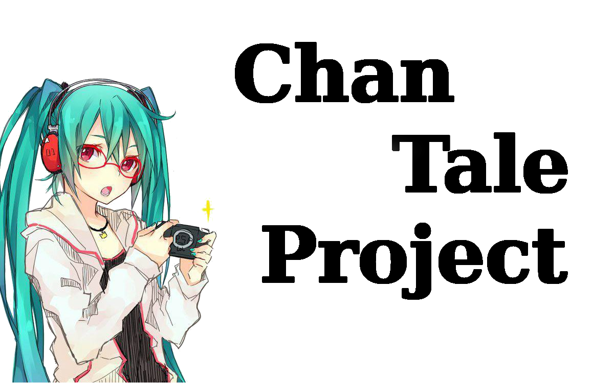

# ChanTale

## What is this?
An open-source NosTale engine implementation in SDL2.\
Main goals are:
1. Run NosTale on *nix operating systems like Linux/macOS
2. Run NosTale on mobile platforms like iOS/Android
3. Better performance and stability
4. Backwards compatibility with whole NosTale engine.
5. Ability to load customizable plugins.
6. Vulkan compatibility (Linux) and MoltenVK (macOS)
7. An probably waste of my time, but i'm lonely so I give an finger that Linus Torvalds gave to Nvidia

## Build system
For now I develop whole engine under Windows but I have triple boot so I can *debug and test* issues under other systems.\
But please, don't consider I will repair issues under FreeBSD or TempleOS but *we* hope everything will work.

## KenOS support
As I'm less busy with work and supporting in various ways Linux software testing I have enough free time to develop meme operating system.\
So, yes, if KenOS will be released (I hope it will be not) ChanTale will support it.

###### I write stuff not because it passionate me but because I'm bored most of the time as hell.